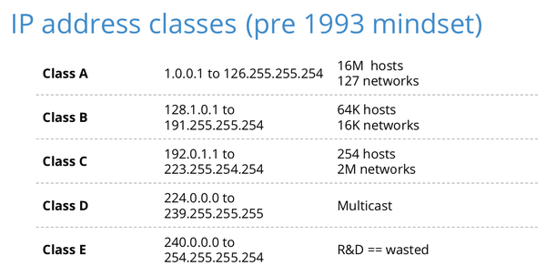

# IP address

1. IP address là gì?
   * IP là viết tắt của Internet Protocol
   * **IP address** là địa chỉ gồm nhiều con số để các thiết bị hiện nay có thể nhận diện , liên lạc trên mạng máy tính thông qua IP (internet protocol)
   * **Internet protocol** là 1 tập hợp các chuẩn, rules để internet hoạt động
   * IP address có 2 version là gì IPv4, IPv6
     * **IPv4:** được chia ra làm 4 phần được ngân cách bởi dấu cách. Mỗi phần sẽ có giá trị từ (0 - 255) cơ số 10
       ```
       ví dụ:  192.168.72.1
       ```
     * Máy tính không hiểu được địa chỉ cơ số 10 kia nên nó sẽ được biểu diễn dưới dạng cơ số 2 (0000000 - 11111111)
     * Địa chỉ IP sẽ gồm 32 bits nhị phân chia làm 4 phần, Mỗi phần 8 bits. Vậy chúng ta sẽ có số lượng địa chỉ IP là 2^32 = 4.294.867.296 thiết bị
     * **IPv6:** Để đáp ứng nhu cầu về số lượng địa chỉ IP 
2. Cấu tạo địa chỉ IP:
   * Được chia làm 2 phần NetworkID và phần HostID
   
   * Địa chỉ IP đc chia thành 5 lớp: A, B, C, D, E và loopback
     * Lớp A: bao gồm các địa chỉ IP từ 1 - 126. Dùng 8 bits đầu dùng làm network ID còn lại là hostID
     * Lớp B: bao gồm các địa chỉ IP từ 128 - 191. Dùng 16 bits đầu làm networkID còn làm HostID
     * Lớp C: bao gồm các địa chỉ IP từ 192 - 223. Dùng 24 bit đầu làm networkID còn lại làm HostID
     * Lớp D: bao gồm các địa chỉ IP từ 244 - 239 dành cho địa chỉ broacast/multibroadcast
     * Lớp E: bao gồm các địa chỉ IP từ 240 - 255
  
     

3. Các loại địa chỉ IP
   * IP private: là địa chỉ ip được thiết lập trong hệ thống mạng cục bộ
   * IP public: là địa chỉ dùng để giao tiếp kết nối với các thiết bị bên ngoài môi trường public network và được cung cấp bởi ISP
   * IP động: là ip được cấp tự động cho các thiết bị khi tham gia kết nối vào mạng
   * IP tĩnh: là ip được cấu hình cố định không bị thay đổi mỗi lần tham gia vào mạng

     

     
